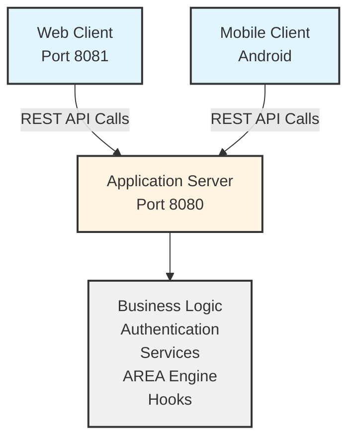

# AREA

An automation platform similar to IFTTT/Zapier that enables users to connect various services and create automated workflows through Actions and REActions.

## Table of Contents

- [Overview](#overview)
- [Architecture](#architecture)
- [Features](#features)
- [Technology Stack](#technology-stack)
- [Prerequisites](#prerequisites)
- [Installation](#installation)
- [API Documentation](#api-documentation)
- [Docker Deployment](#docker-deployment)
- [Development](#development)
- [Accessibility](#accessibility)
- [Security Considerations](#security-considerations)
- [Troubleshooting](#troubleshooting)
- [References](#references)
- [Authors](#authors)
- [Support](#support)
- [Contributing](#contributing)
- [License](#license)

## Overview

ACTION-REACTION is a comprehensive automation platform consisting of three main components:

- **Application Server**: Core business logic and REST API
- **Web Client**: Browser-based interface
- **Mobile Client**: Android mobile application

The platform allows users to create automated workflows (AREAs) by connecting Actions (triggers) from one service to REActions (responses) from another service.

## Architecture



### Component Responsibilities

- **Application Server**: Handles all business logic, user authentication, service integrations, AREA execution, and hook management
- **Web Client**: Provides user interface for browser access, forwards all requests to the application server
- **Mobile Client**: Provides native Android interface, forwards all requests to the application server

## Features

### User Management

- User registration and account creation
- Email confirmation workflow
- OAuth2 authentication (Google, Facebook, Twitter/X)
- Username/password authentication
- User profile management
- Administration dashboard

### Service Integration

- Connect multiple third-party services
- OAuth2 service subscription
- Service management from user profile
- Dynamic service discovery

### Actions and REActions

| **Service**       | **Actions (Triggers)**                                                           | **Reactions (Tasks)**            |
|-------------------|----------------------------------------------------------------------------------|----------------------------------|
| **Timer**         | - At a specific moment                                                           |                                  |
| **Gmail**         | - Receive email (with optional conditions)                                       | - Send email                     |
| **YouTube**       | - New video from a channel<br>- Like on a video<br>- New subscriber on a channel | - Like a video                   |
| **X (Twitter)**   | - New tweet with hashtag `#X`<br>- New user follows you                          | - Post a tweet<br>- Like a tweet |
| **Discord (bot)** | - Message posted (with optional conditions)                                      | - Send message in a channel      |
| **Deezer**        | - New album from artist `X` released                                             | - Add song to playlist           |

### AREA Workflows

- Create custom automation workflows
- Connect any Action to any REAction
- Configure Action parameters
- Configure REAction parameters
- Enable/disable workflows
- View workflow execution history

### Hook System

- Automatic workflow execution
- Event monitoring and detection
- Condition verification
- State management to prevent duplicate executions
- Asynchronous task execution

## Technology Stack

**Backend:**

- Framework: [Node.js](https://nodejs.org/) with [NestJS](https://nestjs.com/)
- Database: [PostgreSQL](https://www.postgresql.org/)
- Authentication: [JWT](https://www.jwt.io/), [OAuth2](https://auth0.com/fr/intro-to-iam/what-is-oauth-2)
- API Type: [RESTful](https://fr.wikipedia.org/wiki/Representational_state_transfer)

**Frontend (Web):**

- Framework: [React](https://react.dev/)
- HTTP Client: [Fetch API](https://developer.mozilla.org/en-US/docs/Web/API/Fetch_API) / [Axios](https://axios-http.com/)
- UI Framework: [Tailwind CSS](https://tailwindcss.com/)

**Mobile:**

- Platform: [Android](https://www.android.com/)
- Language: [Flutter](https://flutter.dev/)

**DevOps:**

- Containerization: [Docker](https://www.docker.com/) & [Docker Compose](https://docs.docker.com/compose/)
- Continuous Integration: [GitHub Actions](https://github.com/features/actions)
- Continuous Deployment: [Jenkins](https://www.jenkins.io/)

## Prerequisites

- [Docker](https://docs.docker.com/engine/install/) - version **28.4+**
- [Docker Compose](https://docs.docker.com/compose/install/) - version **2.39+**
- [Node.js](https://nodejs.org/en/download) - version **22.19+** *(for local development)*
- [NPM](https://nodejs.org/en/download) - version **11.6+** *(for local development)*
- [Flutter](https://docs.flutter.dev/get-started) - version **3.35+** *(for local development)*
- [Dart SDK](https://docs.flutter.dev/get-started) - version **3.9+** *(for local development)*

## Installation

### Using Docker (Recommended)

Clone the repository:

```bash
git clone https://github.com/Enoal-Fauchille-Bolle/AREA.git
cd AREA
```

Build the Docker images:

```bash
docker-compose build
```

Start the services:

```bash
docker-compose up
```

The application will be available at:

- Application Server: `http://localhost:8080`
- Web Client: `http://localhost:8081`
- Mobile Client APK: `http://localhost:8081/client.apk`

### Local Development Setup

#### Application Server

```bash
cd application-server
npm install
npm run start:dev
```

#### Web Client

```bash
cd web-client
npm install
npm run dev
```

#### Mobile Client

```bash
cd mobile-client
flutter run
```

More details are available about the developement, environment variables and configuration in these files:

- [Application Server Configuration](./docs/APPLICATION_SERVER.md)
- [Web Client Configuration](./docs/WEB_CLIENT.md)
- [Mobile Client Configuration](./docs/MOBILE_CLIENT.md)

### Creating Your First AREA

1. **Register/Login**
   - Create an account or login with OAuth2 provider
   - Confirm your email address

2. **Subscribe to Services**
   - Navigate to "Services" page
   - Click "Connect" on desired services
   - Authorize the application via OAuth2

3. **Create an AREA**
   - Go to "My AREAs" page
   - Click "Create New AREA"
   - Select an Action service and configure the trigger
   - Select a REAction service and configure the response
   - Name your AREA and activate it

4. **Monitor Execution**
   - View AREA execution logs in the dashboard
   - Receive notifications when AREAs are triggered
   - Enable/disable AREAs as needed

### Example AREAs

**Gmail to Discord**

- Action: Email received with a message containing "urgent"
- REAction: Send message to Discord channel with the message

**Deezer to X**

- Action: New album released by artist "Coldplay"
- REAction: Send tweet announcing the new album

**Timer to YouTube**

- Action: At 8 AM the 30 September 2026
- REAction: Like a specific video

## API Documentation

You can see the full [API documentation here](./docs/APPLICATION_SERVER.md).

## Docker Deployment

### Docker Compose Structure

TODO

```yaml
name: area
services:
  application_server:
    build: ./application-server
    name: application-server
    ports:
      - "8080:8080"
    environment:
      - NODE_ENV=production
    depends_on:
      - database

  web_client:
    build: ./web-client
    name: web-client
    ports:
      - "8081:8081"
    depends_on:
      - server
      - client_mobile
    volumes:
      - mobile-builds:/usr/share/nginx/html/mobile

  mobile_client:
    build: ./mobile-client
    name: mobile-client
    volumes:
      - mobile-builds:/app/build # TODO: Adjust path as needed

  database:
    image: postgres:14
    # environment:
    #   POSTGRES_DB: area
    #   POSTGRES_USER: user
    #   POSTGRES_PASSWORD: password
    env_file:
      - ./application-server/.env
    volumes:
      - db-data:/var/lib/postgresql/data

volumes:
  mobile-builds:
  db-data:
```

### Commands

Build all services:

```bash
docker-compose build
```

Start all services:

```bash
docker-compose up
```

Start in detached mode:

```bash
docker-compose up -d
```

View logs:

```bash
docker-compose logs -f
```

Stop all services:

```bash
docker-compose down
```

## Development

### Project Structure

```txt
AREA/
├── README.md                   # Main documentation file
├── LICENSE                     # License information
├── HOWTOCONTRIBUTE.md          # Contribution guidelines
├── assets/                     # Shared assets (images, icons, etc.)
├── dev/                        # Development scripts and tools
├── docs/                       # Documentation files
├── shared/                     # Shared code and resources
├── application-server/         # Backend server
│   ├── src/
│   ├── test/
│   ├── tsconfig.build.json
│   └── tsconfig.json
├── web-client/                 # Web frontend
│   ├── public/
│   └── src/
└── mobile-client/              # Mobile application
    ├── android/
    ├── assets/
    ├── lib/
    └── test/
```

### Running Tests

**Server:**

```bash
cd application-server
npm test
```

**Web Client:**

```bash
cd web-client
npm test
```

**Mobile Client:**

```bash
cd mobile-client
./gradlew test
```

### Code Style

This project follows industry-standard coding conventions:

- Use ESLint for JavaScript/TypeScript
- Use Prettier for code formatting
- Follow RESTful API design principles
- Write meaningful commit messages using Conventional Commits

## Accessibility

This application follows WCAG 2.1 guidelines to ensure accessibility:

- Semantic HTML structure
- ARIA labels where appropriate
- Keyboard navigation support
- Screen reader compatibility
- Sufficient color contrast ratios
- Responsive design for various screen sizes

## Security Considerations

- All passwords are hashed using bcrypt
- JWT tokens expire after configured period
- OAuth2 tokens are stored securely
- API endpoints are protected with authentication middleware
- Input validation on all endpoints
- CORS configured appropriately
- SQL injection prevention
- XSS protection

## Troubleshooting

### Common Issues

**Port already in use:**

```bash
# Change ports in docker-compose.yml or kill the process
lsof -ti:8080 | xargs kill -9
```

**Database connection failed:**

- Check DATABASE_URL in .env file
- Ensure database service is running
- Verify credentials

**OAuth2 redirect URI mismatch:**

- Update redirect URIs in OAuth2 provider settings
- Ensure callback URLs match in .env file

**Mobile app can't connect to server:**

- Use local network IP instead of localhost
- Check firewall settings
- Verify server is accessible from mobile device

## References

### Related Documentation

- [Application Server Configuration](./docs/APPLICATION_SERVER.md)
- [Web Client Configuration](./docs/WEB_CLIENT.md)
- [Mobile Client Configuration](./docs/MOBILE_CLIENT.md)

### External Resources

- [NestJS Documentation](https://docs.nestjs.com/)
- [React Documentation](https://react.dev/)
- [Flutter Documentation](https://docs.flutter.dev/)
- [PostgreSQL Documentation](https://www.postgresql.org/docs/)

## Authors

- **Samuel Giret**: [SamGave07](https://github.com/SamGave07) - Backend Developer
- **Enoal Fauchille-Bolle**: [Enoal-Fauchille-Bolle](https://github.com/Enoal-Fauchille-Bolle) - Backend Developer
- **Evan Mahe**: [Mahe-Evan](https://github.com/Mahe-Evan) - Mobile Developer
- **Quentin Gerard**: [quent1111](https://github.com/quent1111) - Frontend Developer
- **Renaud Manet**: [renman-ymd](https://github.com/renman-ymd) - Fullstack Developer

## Support

For support, please:

- Open an issue on GitHub
- Contact the development team
- Check the documentation in `/docs`

## Contributing

Please refer to [HOWTOCONTRIBUTE.md](./HOWTOCONTRIBUTE.md) for detailed information on how to contribute to this project.

## License

This project is licensed under the GNU v3 License, see the [LICENSE file](./LICENSE) for details.
