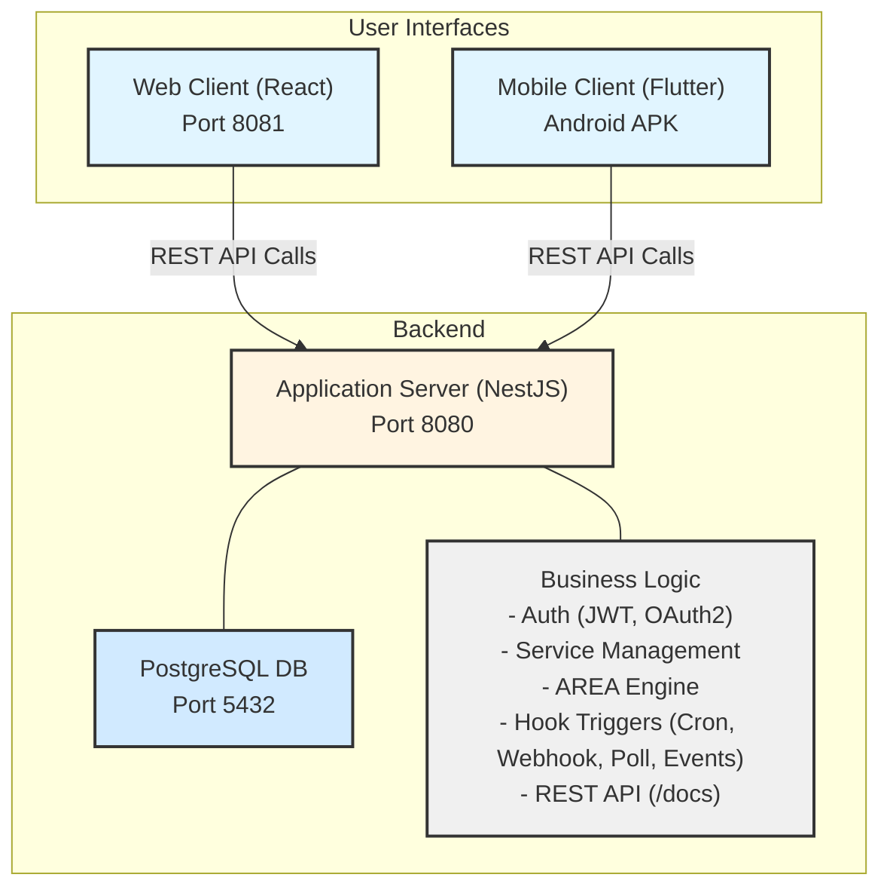

# AREA (Action-REAction)

[](https://github.com/Enoal-Fauchille-Bolle/AREA/actions/workflows/chocolatine.yaml) [](https://github.com/Enoal-Fauchille-Bolle/AREA/issues) [](https://github.com/Enoal-Fauchille-Bolle/AREA/pulls) [](https://github.com/Enoal-Fauchille-Bolle/AREA/commits/main) [](https://github.com/Enoal-Fauchille-Bolle/AREA/graphs/contributors)  
[](https://nestjs.com/) [](https://reactjs.org/) [](https://flutter.dev/) [](https://www.typescriptlang.org/) [](https://www.postgresql.org/) [](https://www.docker.com/)
[](https://www.gnu.org/licenses/gpl-3.0) [](https://conventionalcommits.org) [](https://prettier.io/) [](http://commitizen.github.io/cz-cli/)

AREA is an automation platform developed as part of the Epitech Tek3 curriculum (G-DEV-500). Inspired by services like IFTTT and Zapier, it allows users to connect various online services and create automated workflows by linking triggers (Actions) from one service to tasks (REActions) in another.

## Table of Contents

- [Overview](#overview)
- [Architecture](#architecture)
- [Implemented Features](#implemented-features)
  - [Core](#core)
  - [Services & Components](#services--components)
- [Technology Stack](#technology-stack)
- [Prerequisites](#prerequisites)
- [Getting Started (Docker - Recommended)](#getting-started-docker---recommended)
- [Local Development Setup (Alternative)](#local-development-setup-alternative)
- [Usage Example](#usage-example)
- [API Documentation](#api-documentation)
- [Project Structure](#project-structure)
- [Testing](#testing)
- [Code Style & Conventions](#code-style--conventions)
- [Accessibility](#accessibility)
- [Security Considerations](#security-considerations)
- [Troubleshooting](#troubleshooting)
- [Documentation & References](#documentation--references)
- [Authors](#authors)
- [Contributing](#contributing)
- [License](#license)

## Overview

This project consists of three main components working together:

1. **Application Server (`application-server/`)**: A NestJS backend handling all business logic, user authentication (email/password & Google OAuth2), service integrations, database interactions (PostgreSQL via TypeORM), AREA creation/execution, and the REST API.
2. **Web Client (`web-client/`)**: A React (Vite + TypeScript) single-page application providing a browser-based interface. It communicates exclusively with the Application Server via the REST API.
3. **Mobile Client (`mobile-client/`)**: A Flutter application (targeting Android) providing a native mobile interface. It also communicates exclusively with the Application Server via the REST API.

The primary goal, as defined by the [Epitech subject](./docs/G-DEV-500_AREA.pdf), is to integrate existing services and technologies, focusing on the "glue code" that connects them to create meaningful automations. Business logic resides *only* on the server-side.

## Architecture



- Clients (Web & Mobile) interact with the Application Server via its REST API.
- The Application Server contains all core logic and interacts with the PostgreSQL database.
- Authentication uses JWT tokens issued by the server. OAuth2 flows are initiated by clients, but the code exchange and token handling occur on the server.

## Implemented Features

### Core

- **User Management**: Registration (Email/Username/Password), Login (Email/Password), Google OAuth2 Login/Registration, Profile fetching/updating (`/auth/me`).
    *(Note: Email confirmation after registration is required by the subject but not yet implemented)*.
    *(Note: Login uses Email, while the subject mentions Username)*.
- **AREA Workflow Management**: Create, view, activate/deactivate, delete AREAs linking one Action to one REAction.
- **Service Linking**: Connect/disconnect accounts for integrated services, including OAuth2 flow for required services (Google, Discord, GitHub, Gmail, Twitch).
- **Parameter Configuration**: Define specific parameters for Actions and REActions when creating an AREA, including support for variable interpolation (using `{{variable_name}}` syntax).
- **Execution History**: Basic tracking of AREA executions (status, trigger data, errors).
- **Hook System**: Automatic triggering of AREAs via:
  - Cron Jobs (`@nestjs/schedule`): For time-based actions.
  - Webhooks: Receiving events from external services (e.g., GitHub).
  - API Polling: Periodically checking external APIs (e.g., Gmail, Twitch).
  - Event Listeners: Real-time events via SDKs (e.g., Discord Bot).
- **State Management**: Prevents duplicate triggers for relevant actions.
- **Server Metadata**: `/about.json` endpoint providing server time, client IP, and available services/actions/reactions as required.

### Services & Components

Based on `application-server/src/services/services-initializer.service.ts`:

| Service           | Actions Implemented                                               | REActions Implemented              | Requires Auth            |
|-------------------|-------------------------------------------------------------------|------------------------------------|--------------------------|
| **Clock (Timer)** | `daily_timer`, `weekly_timer`, `monthly_timer`, `interval_timer`  |                                    | No                       |
| **Email**         |                                                                   | `send_email`                       | No (uses env)            |
| **Gmail**         | `new_email_received` *(via Polling)*                              | `send_gmail`                       | Yes (OAuth2)             |
| **Google**        | *(Service exists for Auth)*                                       |                                    | Yes (OAuth2)             |
| **Discord**       | `message_posted`, `reaction_added`                                | `send_message`, `react_to_message` | Yes (OAuth2 & Bot Token) |
| **GitHub**        | `push_event`, `pull_request_event`, `issue_event` *(via Webhook)* |                                    | Yes (OAuth2)             |
| **Twitch**        | `stream_live` *(via Polling)*                                     | `Messages`                         | Yes (OAuth2)             |
| **Spotify**       |                                                                   | `add_to_playlist`, `add_to_queue`  | Yes (OAuth2)             |
| **Reddit**        | `hot_post_in_subreddit`                                           | `create_reddit_post`               | Yes (OAuth2)             |

## Technology Stack

- **Backend**: Node.js, NestJS, TypeScript, PostgreSQL, TypeORM, JWT, Passport.js, Bcrypt
- **Frontend (Web)**: React, Vite, TypeScript, Tailwind CSS, React Router, Fetch API
- **Mobile**: Flutter, Dart, http, webview\_flutter, flutter\_dotenv, shared\_preferences (Targets Android)
- **DevOps**: Docker, Docker Compose, Nginx (for web client serving), GitHub Actions (CI)

## Prerequisites

- **For Docker Deployment**:
  - [Docker Engine](https://docs.docker.com/engine/install/) (v20+)
  - [Docker Compose](https://docs.docker.com/compose/install/) (v2+)
- **For Local Development (Optional)**:
  - [Node.js](https://nodejs.org/) (v22 recommended)
  - [npm](https://www.npmjs.com/) (v10+) or [pnpm](https://pnpm.io/) (v10+)
  - [Flutter SDK](https://docs.flutter.dev/get-started/install) (3.35+)
  - [Dart SDK](https://www.google.com/search?q=https://dart.dev/get-sdk) (3.9+)
  - [PostgreSQL](https://www.postgresql.org/download/) Server (16+)
  - Android Development Environment (e.g. Android Studio, SDK, Emulator/Device) for mobile development.

## Getting Started (Docker - Recommended)

This is the simplest way to get the entire application running.

1. **Clone the repository:**

    ```bash
    git clone https://github.com/Enoal-Fauchille-Bolle/AREA.git
    cd AREA
    ```

2. **Configure Environment Variables:**

      - Copy the example environment files:

        ```bash
        cp application-server/.env.example application-server/.env
        cp web-client/.env.example web-client/.env
        cp mobile-client/.env.example mobile-client/.env
        # Also copy the root .env.example if needed for docker-compose variables
        TODO: mobile-client/android/...
        cp .env.example .env
        ```

      - Edit the `.env` files (especially `application-server/.env`) to set:
          - Database credentials (`POSTGRES_USER`, `POSTGRES_PASSWORD`, `POSTGRES_DB`). **Ensure these match between `docker-compose.yaml` and `application-server/.env`**.
          - `JWT_SECRET` (generate a strong random string).
          - OAuth Client IDs/Secrets for services you want to use (Google, Discord, GitHub, etc.). Get these from the respective developer consoles.
          - Redirect URIs must match your setup (e.g., `http://localhost:8080/auth/callback` for server, potentially different ones for clients).
          - `SERVER_URL` (e.g., `http://localhost:8080`).
          - `DISCORD_BOT_TOKEN` if using Discord features.

3. **Build and Start Containers:**

    ```bash
    docker-compose build
    docker-compose up -d # Use -d to run in detached mode (background)
    ```

    *(Note: The first build, especially for the mobile client, can take a significant amount of time.)*

4. **Access Services:**

      - **Application Server API**: `http://localhost:8080`
      - **API Docs (Swagger)**: `http://localhost:8080/docs`
      - **Web Client**: `http://localhost:8081`
      - **Mobile Client APK**: Download from `http://localhost:8081/client.apk` and install on an Android device/emulator.

5. **Stopping:**

    ```bash
    docker-compose down
    ```

## Local Development Setup (Alternative)

Run each component individually without Docker containers (requires installing all prerequisites).

1. **Clone & Configure:** Follow steps 1 & 2 from the Docker setup to clone and configure `.env` files. Ensure `POSTGRES_HOST` points to your local DB address (often `localhost` or `127.0.0.1`).

2. **Start Database:** Ensure your local PostgreSQL server is running.

3. **Install Dependencies:** At the root of the project, run:

    ```bash
    npm install # or pnpm install
    ```

4. **Start Application Server:**

    ```bash
    npm run dev:server
    ```

    *(Server runs on `http://localhost:8080` by default)*

5. **Start Web Client:**

    ```bash
    npm run dev:web
    ```

    *(Web client runs on `http://localhost:8081` by default)*

6. **Run Mobile Client:**

      - Ensure an Android emulator is running or a device is connected.
      - Update `URL_BASE` in `mobile-client/.env` to point to your machine's local network IP (e.g., `http://192.168.1.100`) accessible by the emulator/device, **not** `localhost`.

    <!-- end list -->

    ```bash
    npm run build:mobile
    ```

## Usage Example

1. Open the Web Client (`http://localhost:8081`) or the installed Mobile App.
2. **Sign Up** for a new account or **Login**.
3. Navigate to the **Services** page (Mobile) or relevant section (Web - likely User Profile) to connect your accounts (e.g., link your Google, Discord accounts via OAuth2).
4. Navigate to **My Areas** (or similar) and click **Create**.
5. Follow the steps:
      - Choose an **Action Service** (e.g., Clock).
      - Choose an **Action Component** (e.g., `daily_timer`).
      - Choose a **REAction Service** (e.g., Email).
      - Choose a **REAction Component** (e.g., `send_email`).
      - Configure **Parameters** (e.g., set time `09:00` for the timer, set recipient `me@example.com` and subject `Daily Update` for the email).
      - Give your AREA a **Name** (e.g., "Daily Email Alert").
      - **Create** the AREA.
6. Ensure the AREA is active. It will now run automatically based on the trigger.

## API Documentation

The REST API provided by the Application Server is documented using Swagger/OpenAPI.

- **Live Documentation**: Access <http://localhost:8080/docs> while the server is running.
- **Static Documentation**: See [docs/ENDPOINTS.md](https://www.google.com/search?q=docs/ENDPOINTS.md) for a detailed list of endpoints.
- **Server Configuration**: See [docs/APPLICATION\_SERVER.md](https://www.google.com/search?q=docs/APPLICATION_SERVER.md) for backend details.

## Project Structure

```txt
AREA/
├── .github/              # GitHub Actions workflows, issue templates
├── .husky/               # Git hooks (linting, commit messages)
├── application-server/   # NestJS Backend source code, Dockerfile, tests
├── assets/               # Shared images (e.g., user flow diagrams)
├── dev/                  # Development utilities (e.g., local DB setup)
├── docs/                 # Project documentation files (subject, API, etc.)
├── mobile-client/        # Flutter Mobile App source code, Dockerfile, tests
├── web-client/           # React Web App source code, Dockerfile, tests
├── .dockerignore
├── .gitignore
├── commitlint.config.ts  # Commit message linting rules
├── docker-compose.yaml   # Main Docker Compose file for orchestration
├── HOWTOCONTRIBUTE.md    # Guide for contributors
├── LICENSE               # Project License (GNU v3)
├── package.json          # Root package file (for workspace commands like commit)
├── pnpm-workspace.yaml   # PNPM workspace configuration
└── README.md             # This file
```

## Testing

Each component has its own testing setup:

- **Application Server (NestJS)**: Unit and Integration/E2E tests using Jest.

    ```bash
    npm run test:server       # Run unit tests & integration tests
    ```

- **Web Client (React)**: Component tests using Vitest and React Testing Library.

    ```bash
    npm run test:web
    ```

- **Mobile Client (Flutter)**: Widget tests using `flutter_test`.

    ```bash
    npm run test:mobile
    ```

Tests are automatically run on push/pull request via GitHub Actions.

## Code Style & Conventions

- **Formatting**: Prettier (TypeScript/JavaScript), Dart Formatter. Enforced via Husky pre-commit hooks.
- **Linting**: ESLint (TypeScript/JavaScript), Flutter Analyze (Dart). Enforced via Husky pre-commit hooks.
- **Commits**: Conventional Commits standard enforced via Commitlint and Husky hooks. Use `npm run commit` at the root for interactive commit message generation.

## Accessibility

Web client development aims to follow WCAG guidelines. Basic accessibility tests are included. Further auditing and testing are encouraged. Mobile client accessibility relies on Flutter's built-in support.

## Security Considerations

- **Authentication**: Passwords hashed with bcrypt. JWT tokens used for session management with configurable expiration.
- **Authorization**: API endpoints protected using `JwtAuthGuard`. *(Admin role/guard mentioned but not fully implemented)*.
- **OAuth2**: Secure handling of OAuth tokens (stored in DB, refresh mechanism).
- **Input Validation**: DTOs validated using `class-validator`.
- **Dependencies**: Regularly update dependencies to patch vulnerabilities.
- **Secrets Management**: Use `.env` files for sensitive credentials; do not commit them.

## Troubleshooting

- **Port Conflicts**: If `docker-compose up` fails due to ports (8080, 8081, 5432) being in use, stop the conflicting service or change the host port mapping in `docker-compose.yaml`.
- **Database Connection**: Ensure the PostgreSQL container (`database`) is running. Verify credentials in `application-server/.env` match those used by the database service in `docker-compose.yaml`. Check firewall settings.
- **Mobile Client Connection**: Ensure `URL_BASE` in `mobile-client/.env` points to the correct IP address of your machine on the local network (not `localhost`), accessible from the emulator/device.
- **OAuth Redirect URI Mismatch**: Ensure Redirect URIs in your `.env` files and configured in the OAuth provider's developer console (Google, Discord, etc.) exactly match.

## Documentation & References

- **This File**: General overview and setup.
- **[docs/G-DEV-500\_AREA.pdf](https://www.google.com/search?q=docs/G-DEV-500_AREA.pdf)**: The official Epitech project subject.
- **[docs/APPLICATION\_SERVER.md](https://www.google.com/search?q=docs/APPLICATION_SERVER.md)**: Detailed backend documentation.
- **[docs/WEB\_CLIENT.md](https://www.google.com/search?q=docs/WEB_CLIENT.md)**: Detailed web client documentation.
- **[docs/MOBILE\_CLIENT.md](https://www.google.com/search?q=docs/MOBILE_CLIENT.md)**: Detailed mobile client documentation.
- **[docs/DATABASE.md](https://www.google.com/search?q=docs/DATABASE.md)**: Database schema details.
- **[docs/ENDPOINTS.md](https://www.google.com/search?q=docs/ENDPOINTS.md)**: Detailed API endpoint list.
- **[HOWTOCONTRIBUTE.md](https://www.google.com/search?q=HOWTOCONTRIBUTE.md)**: Guide for contributing to the project.
- **API Docs (Live)**: `http://localhost:8080/docs`

## Authors

- **Samuel Giret**: [SamGave07](https://github.com/SamGave07)
- **Enoal Fauchille-Bolle**: [Enoal-Fauchille-Bolle](https://github.com/Enoal-Fauchille-Bolle)
- **Evan Mahe**: [Mahe-Evan](https://github.com/Mahe-Evan)
- **Quentin Gerard**: [quent1111](https://github.com/quent1111)
- **Renaud Manet**: [renman-ymd](https://github.com/renman-ymd)

## Contributing

Contributions are welcome\! Please read the [HOWTOCONTRIBUTE.md](https://www.google.com/search?q=HOWTOCONTRIBUTE.md) guide for details on the process, code standards, and how to add new features.

## License

This project is licensed under the GNU General Public License v3.0 - see the [LICENSE](https://www.google.com/search?q=LICENSE) file for details.
