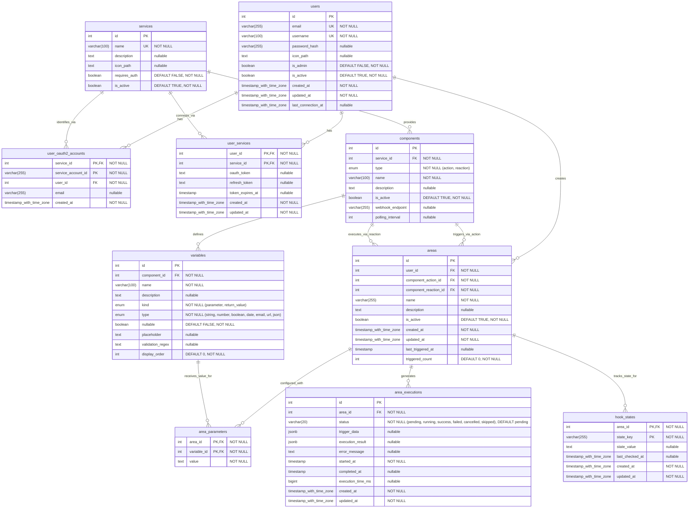

# AREA Application Server Database Schema

This document describes the PostgreSQL database schema used by the AREA Application Server, generated based on the TypeORM entities.

Go back to the [Application Server Documentation](README.md).

## Table of Contents

- [Overview](#overview)
- [ER Diagram](#er-diagram)
- [Table Definitions](#table-definitions)
  - [users](#users)
  - [user_oauth2_accounts](#user_oauth2_accounts)
  - [services](#services)
  - [user_services](#user_services)
  - [components](#components)
  - [variables](#variables)
  - [areas](#areas)
  - [area_parameters](#area_parameters)
  - [area_executions](#area_executions)
  - [hook_states](#hook_states)
- [Relationships](#relationships)

## Overview

The database stores all persistent data for the AREA platform, including user accounts, service definitions, linked services, automation workflows (AREAs), component configurations, execution history, and internal state for triggers. It uses PostgreSQL and is managed via TypeORM migrations (or synchronization in development).

## ER Diagram

## Table Definitions

### `users`

Stores information about registered users.

| Column | Type | Constraints | Description |
|---|---|---|---|
| `id` | `int` | PK, Auto-increment | Unique user identifier. |
| `email` | `varchar(255)` | UK, NOT NULL | User's email address (used for login). |
| `username` | `varchar(100)` | UK, NOT NULL | User's chosen username. |
| `password_hash` | `varchar(255)` | Nullable | Hashed password (using bcrypt). Nullable for OAuth-only users. |
| `icon_path` | `text` | Nullable | Path or URL to the user's avatar/icon. |
| `is_admin` | `boolean` | NOT NULL, DEFAULT FALSE | Flag indicating administrative privileges. |
| `is_active` | `boolean` | NOT NULL, DEFAULT TRUE | Flag indicating if the account is active. |
| `created_at` | `timestamp with time zone` | NOT NULL | Timestamp of user account creation. |
| `updated_at` | `timestamp with time zone` | NOT NULL | Timestamp of the last user account update. |
| `last_connection_at` | `timestamp with time zone` | Nullable | Timestamp of the user's last login. |

### `user_oauth2_accounts`

Links a user's external OAuth2 identity (from a specific service provider) to their internal AREA user account.

| Column | Type | Constraints | Description |
|---|---|---|---|
| `service_id` | `int` | PK, FK -\> `services(id)` | Identifier of the OAuth2 service provider. |
| `service_account_id` | `varchar(255)` | PK, NOT NULL | User's unique ID provided by the OAuth2 service. |
| `user_id` | `int` | FK -\> `users(id)`, NOT NULL | The internal AREA user ID linked to this OAuth account. |
| `email` | `varchar(255)` | Nullable | Email address associated with the OAuth account (if provided). |
| `created_at` | `timestamp with time zone` | NOT NULL | Timestamp when the link was created. |

### `services`

Defines the external services available for integration within AREA.

| Column | Type | Constraints | Description |
|---|---|---|---|
| `id` | `int` | PK, Auto-increment | Unique service identifier. |
| `name` | `varchar(100)` | UK, NOT NULL | Unique name of the service (e.g., "Gmail", "GitHub"). |
| `description` | `text` | Nullable | Description of the service. |
| `icon_path` | `text` | Nullable | Path or URL to the service's icon. |
| `requires_auth` | `boolean` | NOT NULL, DEFAULT FALSE | Whether connecting this service requires user OAuth2 authentication. |
| `is_active` | `boolean` | NOT NULL, DEFAULT TRUE | Whether the service is currently enabled in the platform. |

### `user_services`

Represents a user's connection to a specific service, storing authentication tokens if needed.

| Column | Type | Constraints | Description |
|---|---|---|---|
| `user_id` | `int` | PK, FK -\> `users(id)` | Identifier of the user. |
| `service_id` | `int` | PK, FK -\> `services(id)` | Identifier of the service. |
| `oauth_token` | `text` | Nullable | Encrypted OAuth2 access token (if `requires_auth` is true). |
| `refresh_token` | `text` | Nullable | Encrypted OAuth2 refresh token (if applicable). |
| `token_expires_at` | `timestamp` | Nullable | Expiration timestamp for the `oauth_token`. |
| `created_at` | `timestamp with time zone` | NOT NULL | Timestamp when the user linked the service. |
| `updated_at` | `timestamp with time zone` | NOT NULL | Timestamp when the link details were last updated. |

### `components`

Defines the individual Actions (triggers) and REActions (tasks) provided by each service.

| Column | Type | Constraints | Description |
|---|---|---|---|
| `id` | `int` | PK, Auto-increment | Unique component identifier. |
| `service_id` | `int` | FK -\> `services(id)`, NOT NULL | The service this component belongs to. |
| `type` | `enum` | NOT NULL ('action', 'reaction') | Type of the component. |
| `name` | `varchar(100)` | NOT NULL | Unique name for the component within the service (e.g., "daily\_timer", "send\_email"). |
| `description` | `text` | Nullable | Description of what the component does. |
| `is_active` | `boolean` | NOT NULL, DEFAULT TRUE | Whether the component is currently enabled. |
| `webhook_endpoint` | `varchar(255)` | Nullable | Relative URL path if this component is triggered by a webhook (Actions only). |
| `polling_interval` | `int` | Nullable | Interval in milliseconds/seconds for polling actions (Actions only). Interpretation depends on service logic. |

### `variables`

Defines the configurable parameters (inputs) and return values (outputs) for each component.

| Column | Type | Constraints | Description |
|---|---|---|---|
| `id` | `int` | PK, Auto-increment | Unique variable identifier. |
| `component_id` | `int` | FK -\> `components(id)`, NOT NULL | The component this variable belongs to. |
| `name` | `varchar(100)` | NOT NULL | Name of the variable (e.g., "channel\_id", "email\_subject"). |
| `description` | `text` | Nullable | Description of the variable's purpose. |
| `kind` | `enum` | NOT NULL ('parameter', 'return\_value') | Whether it's a user-configurable input or an output from an action. |
| `type` | `enum` | NOT NULL ('string', 'number', 'boolean', 'date', 'email', 'url', 'json') | Expected data type of the variable. |
| `nullable` | `boolean` | NOT NULL, DEFAULT FALSE | Whether the variable is optional (`true`) or required (`false`) for parameters. |
| `placeholder` | `text` | Nullable | Example value or hint text for user input. |
| `validation_regex` | `text` | Nullable | Regular expression for validating user input (parameters only). |
| `display_order` | `int` | NOT NULL, DEFAULT 0 | Order in which parameters should be displayed in the UI. |

### `areas`

Represents a user-defined automation workflow, linking an Action component to a REAction component.

| Column | Type | Constraints | Description |
|---|---|---|---|
| `id` | `int` | PK, Auto-increment | Unique AREA identifier. |
| `user_id` | `int` | FK -\> `users(id)`, NOT NULL | The user who owns this AREA. |
| `component_action_id` | `int` | FK -\> `components(id)`, NOT NULL | The Action component that triggers this AREA. |
| `component_reaction_id` | `int` | FK -\> `components(id)`, NOT NULL | The REAction component executed by this AREA. |
| `name` | `varchar(255)` | NOT NULL | User-defined name for the AREA. |
| `description` | `text` | Nullable | User-defined description for the AREA. |
| `is_active` | `boolean` | NOT NULL, DEFAULT TRUE | Whether the AREA is currently enabled and should trigger. |
| `created_at` | `timestamp with time zone` | NOT NULL | Timestamp of AREA creation. |
| `updated_at` | `timestamp with time zone` | NOT NULL | Timestamp of the last AREA update. |
| `last_triggered_at` | `timestamp` | Nullable | Timestamp when the AREA was last triggered. |
| `triggered_count` | `int` | NOT NULL, DEFAULT 0 | Counter for how many times the AREA has been triggered. |

### `area_parameters`

Stores the specific values provided by the user for the `PARAMETER` variables of the selected Action and REAction components within an AREA.

| Column | Type | Constraints | Description |
|---|---|---|---|
| `area_id` | `int` | PK, FK -\> `areas(id)` | Identifier of the AREA this parameter belongs to. |
| `variable_id` | `int` | PK, FK -\> `variables(id)` | Identifier of the Variable this parameter provides a value for. |
| `value` | `text` | NOT NULL | The value set by the user. Can contain template placeholders like `{{variable_name}}` for interpolation using action return values. |

### `area_executions`

Logs each instance an AREA is triggered and executed.

| Column | Type | Constraints | Description |
|---|---|---|---|
| `id` | `int` | PK, Auto-increment | Unique execution log identifier. |
| `area_id` | `int` | FK -\> `areas(id)`, NOT NULL | The AREA that was executed. |
| `status` | `varchar(20)` | NOT NULL, DEFAULT 'pending' | Current status (pending, running, success, failed, cancelled, skipped). |
| `trigger_data` | `jsonb` | Nullable | Data provided by the Action trigger (corresponding to `RETURN_VALUE` variables). |
| `execution_result` | `jsonb` | Nullable | Data or result returned by the REAction execution. |
| `error_message` | `text` | Nullable | Error message if the execution failed. |
| `started_at` | `timestamp` | NOT NULL | Timestamp when the execution began processing. |
| `completed_at` | `timestamp` | Nullable | Timestamp when the execution finished (successfully or failed). |
| `execution_time_ms` | `bigint` | Nullable | Duration of the execution in milliseconds. |
| `created_at` | `timestamp with time zone` | NOT NULL | Timestamp when the execution record was created (trigger time). |
| `updated_at` | `timestamp with time zone` | NOT NULL | Timestamp when the execution record was last updated. |

### `hook_states`

Stores internal state information for specific Action triggers within an AREA to prevent duplicate executions (e.g., last processed email ID, last check time).

| Column | Type | Constraints | Description |
|---|---|---|---|
| `area_id` | `int` | PK, FK -\> `areas(id)` | Identifier of the AREA this state belongs to. |
| `state_key` | `varchar(255)` | PK, NOT NULL | A unique key identifying the state being tracked (e.g., "last\_email\_id", "daily\_timer\_2023-10-29"). |
| `state_value` | `text` | Nullable | The value of the state (e.g., an ID, a timestamp, a boolean flag). |
| `last_checked_at` | `timestamp with time zone` | Nullable | Timestamp when the trigger condition was last checked. |
| `created_at` | `timestamp with time zone` | NOT NULL | Timestamp when the state record was created. |
| `updated_at` | `timestamp with time zone` | NOT NULL | Timestamp when the state record was last updated. |

## Relationships

- A `User` can have multiple `Area`s, `UserService` connections, and `UserOAuth2Account` links.
- A `Service` can provide multiple `Component`s and can be linked by multiple `User`s via `UserService` and `UserOAuth2Account`.
- A `Component` belongs to one `Service` and defines multiple `Variable`s. It can be used as an `action` or `reaction` in multiple `Area`s.
- An `Area` belongs to one `User`, uses one Action `Component` and one REAction `Component`. It has multiple `AreaParameter`s, generates multiple `AreaExecution` logs, and can have multiple `HookState` entries.
- A `Variable` belongs to one `Component` and can receive values via `AreaParameter`s across multiple `Area`s.
- `AreaParameter` links an `Area` and a `Variable`, storing a user-provided `value`.
- `AreaExecution` logs executions for an `Area`.
- `HookState` tracks trigger state for an `Area`, identified by a `state_key`.
- `UserService` connects a `User` and a `Service`, storing tokens.
- `UserOAuth2Account` links a `User`'s external provider ID (`service_account_id`) from a `Service` to their internal account.
